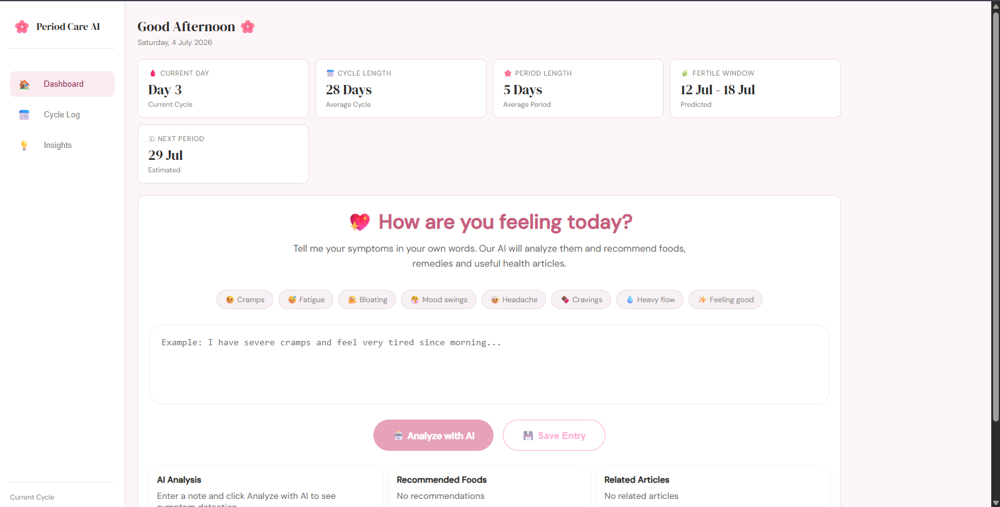
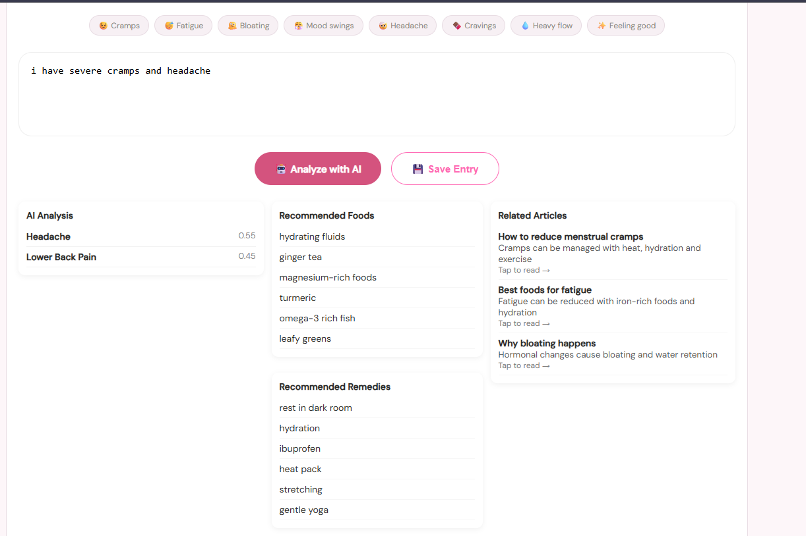
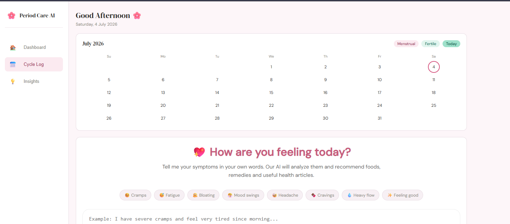
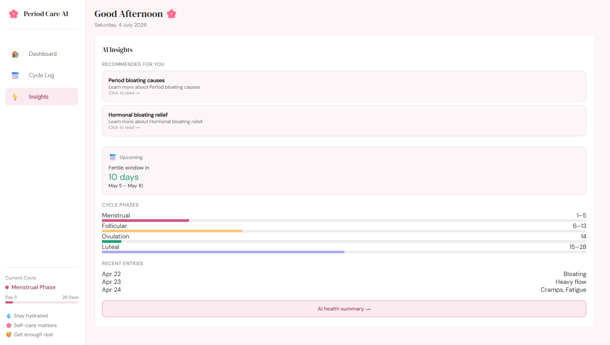

# 🌸 AI Period Tracker

An AI-powered menstrual health tracking web application built using React that helps users track symptoms, visualize their menstrual cycle, and receive personalized health insights.

## 🚀 Live Demo

🔗 **Live Website:** YOUR_VERCEL_LINK_HERE

## 💻 GitHub Repository

🔗 https://github.com/sanyuktaraut09/AI-Period-tracker

---

# ✨ Features

- 📅 Cycle calendar for tracking menstrual cycles
- 📝 Symptom logging with date-wise entries
- 🧠 AI-powered health insights based on logged symptoms
- 📊 Dashboard with cycle statistics
- 🌸 Beautiful and responsive user interface
- 📚 Personalized health article recommendations
- 📈 Cycle phase visualization
- 📋 Recent symptom history

---

# 🛠 Tech Stack

### Frontend

- React.js
- JavaScript (ES6)
- HTML5
- CSS3

### Tools

- Git
- GitHub
- Vercel

---

# 📂 Project Structure

```
src/
│
├── components/
│   ├── Sidebar
│   ├── StatsBar
│   ├── CycleCalendar
│   ├── SymptomLogger
│   ├── InsightPanel
│   └── ArticleCard
│
├── App.js
└── App.css
```

---

# 📸 Project Screenshots

## 🏠 Dashboard



### Dashboard (Continued)



---

## 📅 Cycle Log



---

## 🧠 AI Insights



# 🔮 Future Improvements

- User authentication
- Database integration
- AI chatbot
- Real-time medical article API
- Cycle prediction using machine learning
- Email reminders
- Export reports

---

# 👩‍💻 Author

**Sanyukta Raut**

GitHub:
https://github.com/sanyuktaraut09

---

## ⭐ If you like this project, don't forget to star the repository!
